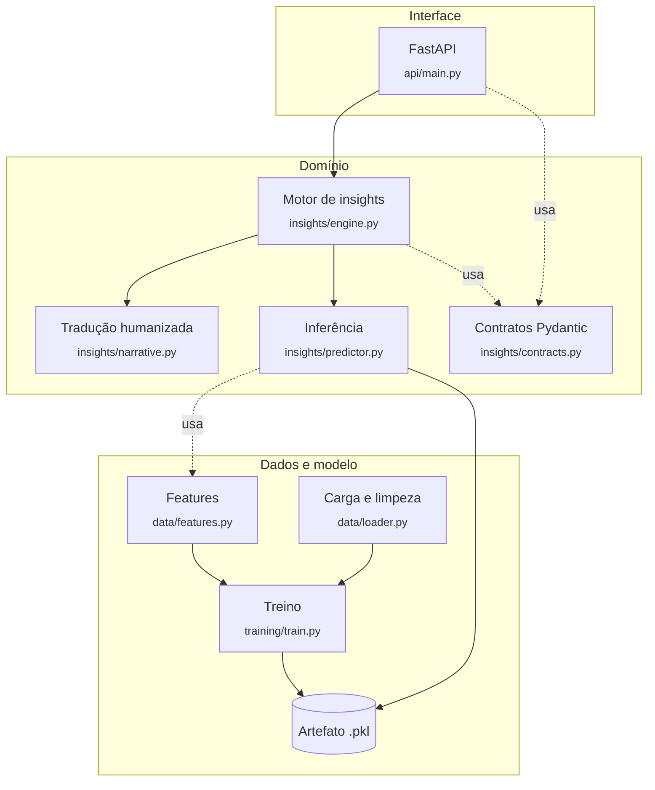
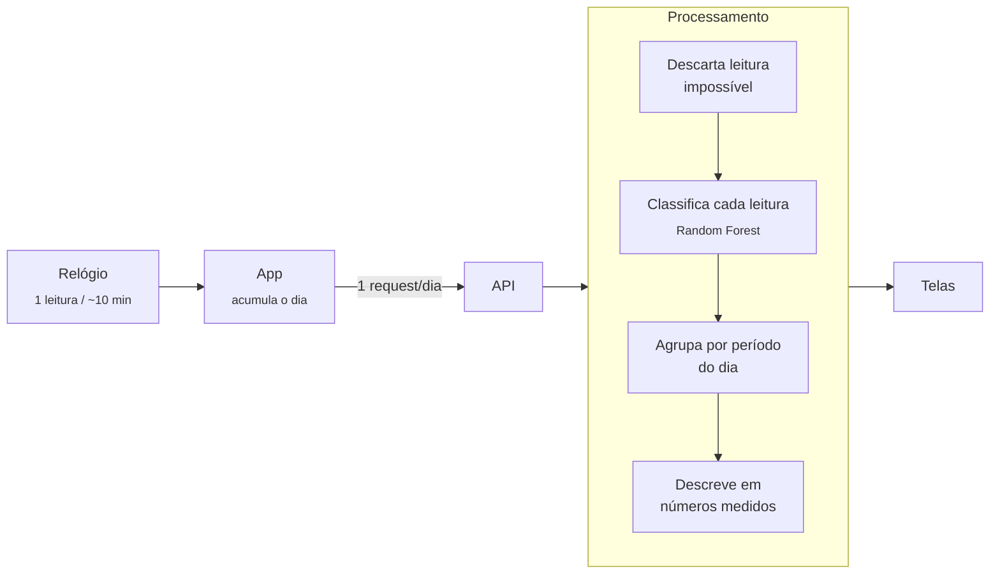

<div align="center">

# DiaElo

### Dados que viram cuidado, não diagnóstico.

Plataforma que lê dados de smartwatches acessíveis e os transforma<br>
em observações compreensíveis sobre a rotina de crianças com TEA.

<br>


<br>

`Tech4Change 2026` · `Grupo 09`

</div>

---

> **Não detecta crises, não diagnostica emoções e não substitui profissionais.**
> Mostra padrões para que a família converse e decida melhor.

---

## Sumário

- [O hackathon](#o-hackathon)
- [A solução](#a-solução)
- [Arquitetura](#arquitetura)
- [Tecnologias](#tecnologias)
- [APIs, modelos de IA e bases de dados](#apis-modelos-de-ia-e-bases-de-dados)
- [Instalação e execução](#instalação-e-execução)
- [Deploy na Oracle Cloud](#deploy-na-oracle-cloud)
- [Especificação da API](#especificação-da-api)
- [Equipe](#equipe)
- [Limitações conhecidas e próximos passos](#limitações-conhecidas-e-próximos-passos)

---

## O hackathon

Este repositório contém a solução desenvolvida pelo **Grupo 09** para o
**TECH4CHANGE 2026**, hackathon cujo tema é _Potencializando o ser humano com
Inteligência Artificial_.

O DiaElo foi concebido e desenvolvido por um time de **três pessoas** ao longo
dos **20 dias** da primeira fase da competição.

O que está neste repositório é um **produto mínimo viável**: demonstra que a
proposta funciona de ponta a ponta, do sensor à frase que a família lê, mas não
constitui um produto acabado. O recorte foi escolhido para sustentar a
demonstração com aquilo que pode ser afirmado de forma honesta, com as
limitações registradas em [seção própria](#limitações-conhecidas-e-próximos-passos).

---

## A solução

### O problema

Responsáveis de crianças com TEA convivem com sinais e mudanças ao longo do
dia, mas não têm uma forma simples de transformar isso em algo compreensível.
Os dados ficam isolados no relógio, sem contexto.

Os aplicativos existentes ficam em dois extremos:

| Abordagem | Problema |
|---|---|
| Apps de exercício | Tratam o corpo como performance, não como rotina |
| Apps de alerta de crise | Produzem ansiedade em tempo real, não entendimento |

O DiaElo ocupa o espaço entre os dois: descreve o dia em linguagem que a
família entende, sem urgência e sem alarme.

### A proposta

**Acompanhar continuamente os sinais que o relógio já capta e devolvê-los à
família como informação compreensível sobre a rotina.** A proposta é o
monitoramento: tornar visível e utilizável aquilo que hoje permanece inacessível
dentro do aparelho.

### O que foi desenvolvido

A aplicação deste repositório é uma **demonstração desse conceito**, não a forma
final do produto. Ela recorta uma fatia do monitoramento — o dia organizado em
quatro períodos, cada um descrito com os números que o relógio mediu — e a
percorre de ponta a ponta, do sensor à frase que a família lê.

Esse recorte foi escolhido por ser o mais direto de construir e validar dentro
dos 20 dias da primeira fase. Outras formas de apresentar o mesmo
acompanhamento são possíveis e estão previstas em
[próximos passos](#limitações-conhecidas-e-próximos-passos).

Dois princípios guiam o que foi construído:

**Só se afirma o que foi medido.** Um Random Forest classifica cada leitura, mas
a classificação não aparece no texto. As frases citam batimento e contagem de
leituras, sempre comparados à média do próprio dia da criança.

**A referência é o próprio dia da criança.** Cada período é medido contra as
outras leituras dela mesma, o que dispensa histórico e funciona desde o primeiro
dia de uso.

---

## Arquitetura

### Visão geral

O sistema é dividido em três camadas, com dependência em uma única direção. A
camada de interface não conhece o modelo, e a camada de domínio não conhece
HTTP.



O treino é um processo **offline**, executado sob demanda. Ele consome o dataset
e produz o artefato `.pkl`. A API nunca treina: apenas carrega o artefato na
inicialização.

### Fluxo de execução



### Decisões de arquitetura

| Decisão | Motivo |
|---|---|
| **Serviço sem estado** | Cada requisição é autocontida, o que permite reiniciar ou replicar a instância livremente e mantém os dados da criança fora de qualquer armazenamento. |
| **Contratos Pydantic compartilhados** | Os mesmos modelos definem o domínio e o schema HTTP. A documentação OpenAPI é gerada da fonte da verdade, sem cópia que possa divergir. |
| **Modelo como artefato versionado** | O `.pkl` guarda o estimador, a ordem das features e as métricas do treino, permitindo que a inferência valide o que recebe. |
| **Separação entre classificar e narrar** | O modelo decide o que merece atenção; o texto cita apenas sensor medido. As duas responsabilidades evoluem de forma independente. |
| **Modelo carregado na inicialização** | O artefato é lido uma única vez, no boot do processo, e reutilizado em todas as requisições. |
| **Treino desacoplado da API** | O treino roda offline e produz o artefato. O serviço em produção apenas consome, sem dependência do dataset. |

### Infraestrutura

A aplicação é empacotada em um container Docker e executada em uma instância
**Oracle Cloud Infrastructure Compute** com Ubuntu. Por não haver banco de
dados nem estado compartilhado, a instância pode ser reiniciada ou substituída
sem perda de informação.

A configuração completa do ambiente está em
[Deploy na Oracle Cloud](#deploy-na-oracle-cloud).

---

## Tecnologias

| Camada | Tecnologia |
|---|---|
| **Linguagem** | Python 3.11+ |
| **Modelo** | scikit-learn (Random Forest) |
| **Processamento de dados** | pandas · NumPy |
| **Serialização do modelo** | joblib |
| **API** | FastAPI · Pydantic v2 |
| **Servidor** | uvicorn |
| **Infraestrutura** | Oracle Cloud Infrastructure (Compute) |
| **Controle de versão** | Git · GitHub |

---

## APIs, modelos de IA e bases de dados

### API desenvolvida

API REST própria, documentada automaticamente via OpenAPI.

| Método | Rota | Descrição |
|:---:|---|---|
| `GET` | `/health` | Estado do serviço e metadados do modelo carregado |
| `POST` | `/insights` | Recebe as leituras da janela, devolve as observações |
| `GET` | `/docs` | Documentação interativa (Swagger), gerada automaticamente |

Nenhuma API externa de terceiros é consumida, e o projeto não depende de
serviços pagos de inteligência artificial.

### Sinais captados

O modelo trabalha com três sinais fisiológicos, todos disponíveis em
smartwatches de baixo custo. Uma leitura não é uma medição instantânea: é uma
**janela agregada** de alguns minutos, porque o RMSSD só existe sobre uma
sequência de batimentos.

#### Frequência cardíaca (`heart_rate`)

Batimentos por minuto, em média na janela. É o sinal mais conhecido e o mais
fácil de medir, mas também o mais ambíguo isoladamente: sobe com exercício,
com susto, com febre e com animação.

Na base utilizada, varia de 55 a 141 bpm.

#### Variabilidade da frequência cardíaca (`rmssd`)

Raiz quadrada da média dos quadrados das diferenças entre intervalos R-R
consecutivos, em milissegundos. Em termos práticos: mede **o quanto o tempo
entre uma batida e a seguinte oscila**.

Um coração em repouso não bate como metrônomo — ele acelera e desacelera
levemente a cada respiração, sob controle do sistema nervoso parassimpático.
Quanto maior essa oscilação, mais o organismo está em estado de recuperação.
Sob ativação, o controle simpático assume, os intervalos ficam regulares e o
RMSSD cai.

É por isso que o RMSSD é o marcador padrão de ativação autonômica na
literatura, e é o sinal de maior peso no modelo. Aplicativos de exercício
costumam ignorá-lo em favor da frequência média.

Na base utilizada, varia de 1 a 77 ms.

#### Índice de atividade (`activity_index`)

Proxy de movimento derivado do acelerômetro, adimensional. Serve para
contextualizar os outros dois: batimento alto acompanhado de muito movimento
tem leitura diferente de batimento alto com o corpo parado.

Na base utilizada, varia de 0 a 2.

#### Como os três se combinam

Médias por estado no conjunto de treino, após limpeza:

| Estado | `heart_rate` | `rmssd` | `activity_index` |
|---|---:|---:|---:|
| `calmo` | 75 ± 5 bpm | 45 ± 8 ms | 0,5 ± 0,2 |
| `intermediario` | 90 ± 7 bpm | 25 ± 5 ms | 0,8 ± 0,2 |
| `acelerado` | 105 ± 10 bpm | 15 ± 4 ms | 1,1 ± 0,2 |

Frequência e variabilidade se movem em **sentidos opostos**: conforme a
ativação aumenta, os batimentos sobem e o intervalo entre eles fica mais
regular. O modelo aprende essa relação conjunta, e não cada sinal isoladamente
— é isso que permite distinguir situações que a frequência cardíaca sozinha
confundiria.

#### Hora da leitura

Não é um sinal fisiológico e quase não contribui para a classificação (peso de
0,01). Está no pipeline por outro motivo: é o eixo que organiza as leituras em
períodos do dia, estruturando toda a apresentação dos resultados.

### Modelo de inteligência artificial

**Random Forest** (scikit-learn) para classificação em três estados: `calmo`,
`intermediario` e `acelerado`. Utiliza apenas variáveis que um smartwatch de
baixo custo entrega.

| Feature | Importância | |
|---|---:|---|
| `RMSSD` — variabilidade da frequência cardíaca | **0,50** | ████████████ |
| `Heart_Rate` — frequência cardíaca | 0,33 | ████████ |
| `Activity_Index` — proxy de movimento | 0,16 | ████ |
| Hora do dia (codificada de forma cíclica) | 0,01 | ▏ |

O RMSSD sozinho pesa mais que os outros três somados. Aplicativos de exercício
costumam olhar a frequência média, mas o marcador de ativação autonômica é a
variabilidade entre batimentos.

O split de treino e teste é feito **por indivíduo** (`Subject_ID`), não por
linha. Um split aleatório colocaria o mesmo sujeito nos dois lados, e a métrica
mediria memorização em vez de generalização.

| Métrica | Valor |
|---|---:|
| F1-macro (teste) | **0,947** |
| Validação cruzada 5-fold por sujeito | 0,950 ± 0,003 |
| Baseline (classe majoritária) | 0,485 |

### Bases de dados

**Dataset de treino:**
[ASD-PhysioStress](https://www.kaggle.com/datasets/ziya07/adolescent-stress-physiology-dataset)
(Kaggle) — 25.000 leituras de 120 indivíduos, com parâmetros fisiológicos
rotulados em três níveis de ativação.

O arquivo não é versionado neste repositório. As instruções de download e o
schema completo estão em [data/README.md](data/README.md).

**Banco de dados da aplicação:** não há. O serviço é sem estado e nada é
persistido entre requisições.

---

## Instalação e execução

### 1. Dependências

```bash
python -m venv .venv
.venv/Scripts/pip install -r requirements.txt   # Linux/Mac: .venv/bin/pip
.venv/Scripts/pip install -e .
```

### 2. Subir a API

O modelo treinado (`models/diaelo_rf.pkl`, 4,7 MB) já vem no repositório, então
não é necessário treinar nada:

```bash
python -m uvicorn diaelo.api.main:app --reload --port 8080
```

A documentação interativa fica em **http://127.0.0.1:8080/docs**.

### 3. Testar

```bash
curl http://127.0.0.1:8080/health
```

```bash
curl -X POST http://127.0.0.1:8080/insights \
     -H "Content-Type: application/json" \
     -d @examples/request-exemplo.json
```

> [!TIP]
> No PowerShell, use `curl.exe`. O `curl` sem extensão é apelido do
> `Invoke-WebRequest`, que tem sintaxe diferente.

<details>
<summary><b>Retreinar o modelo</b></summary>

<br>

Baixe o dataset conforme as instruções em [data/README.md](data/README.md),
coloque o CSV em `data/raw/` e rode:

```bash
python -m diaelo.training.train
```

O script imprime as métricas, salva o artefato em `models/diaelo_rf.pkl` e o
relatório em `reports/metrics.json`.

</details>

---

## Deploy na Oracle Cloud

A API roda containerizada em uma instância de computação da Oracle Cloud
Infrastructure. Esta seção registra como o ambiente foi configurado.

### A instância

| Item | Valor |
|---|---|
| Serviço | OCI Compute (Virtual Machine) |
| Shape | `VM.Standard.E5.Flex` (AMD, x86-64) |
| Capacidade | 1 OCPU (2 vCPUs) · 8 GB de memória |
| Imagem | Canonical Ubuntu 22.04 LTS |
| Região | `sa-saopaulo-1` (São Paulo) |
| Endereço público | IPv4 efêmero |

A arquitetura x86 foi escolhida em vez do shape Ampere (ARM) por dois motivos:
o Ampere costuma estar sem capacidade disponível nas regiões mais usadas, e a
imagem Docker precisaria ser construída para `arm64`, o que acrescentaria uma
categoria inteira de erro sem benefício para o projeto.

### Rede

A instância fica em uma **subnet pública** dentro de uma VCN com internet
gateway e tabela de rotas configurados.

O tráfego externo atravessa **dois filtros independentes**, e ambos precisam
permitir a porta:

**1. Security List da subnet (nível Oracle)**

| Direção | Origem | Protocolo | Porta de destino | Uso |
|---|---|---|---|---|
| Ingress | `0.0.0.0/0` | TCP | 22 | SSH |
| Ingress | `0.0.0.0/0` | TCP | 8000 | API |

**2. iptables (nível sistema operacional)**

As imagens Ubuntu da Oracle já vêm com regras de firewall aplicadas, incluindo
um `REJECT` genérico ao final da cadeia `INPUT`. A regra da aplicação precisa
ser inserida **antes** desse `REJECT`, caso contrário nunca é alcançada:

```bash
sudo iptables -I INPUT 5 -m state --state NEW -p tcp --dport 8000 -j ACCEPT
sudo netfilter-persistent save
```

A posição correta pode ser verificada com
`sudo iptables -L INPUT -n --line-numbers`: a linha de `ACCEPT` da porta 8000
deve aparecer acima da linha de `REJECT`.

### Publicação da aplicação

Instalação do Docker, uma única vez:

```bash
curl -fsSL https://get.docker.com | sudo sh
sudo usermod -aG docker $USER   # exige reconectar a sessão
```

Build e execução:

```bash
git clone https://github.com/AlvaroPereir4/Tech4Change-DiaElo-Grupo-09.git
cd Tech4Change-DiaElo-Grupo-09
docker build -t diaelo .
docker run -d --name diaelo -p 8000:8000 --restart unless-stopped diaelo
```

O parâmetro `--restart unless-stopped` faz o container subir sozinho caso a
instância seja reiniciada.

O container expõe um `HEALTHCHECK` que consulta `/health`. Como esse endpoint
só responde depois que o modelo é carregado, o status `healthy` em
`docker ps` confirma que a aplicação está efetivamente pronta, e não apenas
que o processo existe.

### Ciclo de atualização

O deploy é manual. Para publicar uma nova versão:

```bash
cd ~/Tech4Change-DiaElo-Grupo-09
git pull
docker build -t diaelo .
docker stop diaelo && docker rm diaelo
docker run -d --name diaelo -p 8000:8000 --restart unless-stopped diaelo
```

Builds subsequentes são rápidos: o Docker reaproveita a camada de dependências
enquanto o `requirements.txt` não mudar.

Automatizar esse ciclo via GitHub Actions e OCI Container Registry está
previsto em [próximos passos](#limitações-conhecidas-e-próximos-passos).

---

## Especificação da API

### Entrada

Um lote com **todas as leituras do dia** — cerca de 144 objetos e 17 KB num dia
real. Quatro campos por leitura:

```json
{ "timestamp": "2026-09-17T14:00:00-03:00", "heart_rate": 105.7, "rmssd": 15.2, "activity_index": 1.21 }
```

### Saída

O dia em quatro períodos. Cada um traz os números medidos (`metrics`), como as
leituras se distribuíram entre os estados (`distribution`), e a frase pronta
para exibição (`observation`):

```json
{
  "period": "tarde",
  "label": "à tarde",
  "readings_used": 7,
  "conclusive": true,
  "distribution": { "calmo": 0.0, "intermediario": 0.143, "acelerado": 0.857 },
  "predominant": "acelerado",
  "activation_score": 1.857,
  "metrics": { "heart_rate_avg": 102.7, "rmssd_avg": 17.6, "activity_avg": 1.12 },
  "observation": "À tarde, os batimentos ficaram em média 103 bpm em 7 leituras, 15 bpm acima da média do dia (88 bpm). O movimento nesse período também ficou acima do restante do dia."
}
```

### Três pontos que definem a tela

1. **`periods` sempre traz os quatro períodos**, em ordem cronológica, mesmo os
   sem dado. O layout é fixo, não uma lista dinâmica.
2. **Quando `conclusive` é `false`**, os campos numéricos vêm nulos, mas a
   `observation` vem preenchida explicando a falta. A tela não precisa escrever
   texto de estado vazio.
3. **Todo texto exibido para a família vem pronto do backend.** O front não
   redige frases sobre o estado da criança.

> [!IMPORTANT]
> A especificação completa, campo a campo e com exemplo integral de entrada e
> saída, está em **[docs/API.md](docs/API.md)**.

Há um payload pronto para testes em
[examples/request-exemplo.json](examples/request-exemplo.json): 21 leituras, com
a madrugada vazia e uma leitura impossível de 310 bpm, cobrindo os casos de
borda.

---

## Equipe

- Alvaro Pereira — [@AlvaroPereir4](https://github.com/AlvaroPereir4)
- Nurian Coelho — [@Nuri-an](https://github.com/Nuri-an)
- Kayo Leanndro — [@KayoLeanndro](https://github.com/KayoLeanndro)

---

## Limitações conhecidas e próximos passos

### Limitações do modelo e dos dados

**As métricas vêm de um dataset público de pesquisa.** Elas demonstram que o
pipeline funciona de ponta a ponta, em condições controladas. Não representam
desempenho esperado com dados coletados em uso real.

**A população da base não corresponde ao público-alvo.** O conjunto cobre
adolescentes de 12 a 18 anos.

**Não há dados de sono** no conjunto utilizado, embora a maioria dos aparelhos
os registre.

**Alguns limiares não são calibrados.** Os critérios que decidem quando
mencionar variação de movimento, e quando avisar sobre excesso de leituras
descartadas, foram definidos por estimativa. Calibrá-los exige dado real de uso.

### Limitações da aplicação

**Sem persistência.** Cada requisição é independente. Não há histórico, e
portanto não há comparação entre dias ou semanas.

**Sem autenticação.** A API não possui controle de acesso, e o CORS está aberto
a qualquer origem. Adequado para demonstração, inadequado para uso real com
dados de crianças.

**A coleta é responsabilidade do cliente.** Não há integração direta com nenhum
smartwatch; o aplicativo acumula as leituras e envia o lote.

### Próximos passos

| Funcionalidade | O que viabilizaria |
|---|---|
| Histórico por criança | Comparação entre dias e semanas, e não apenas entre períodos de um mesmo dia |
| Linha de base pessoal acumulada | Referência construída ao longo do tempo, em vez de restrita ao dia corrente |
| Autenticação e restrição de CORS | Pré-requisito para qualquer uso além da demonstração |
| Integração direta com o relógio | Eliminar a dependência de o aplicativo intermediar a coleta |
| Incorporação de dados de sono | Ampliar a leitura da rotina para além do período em vigília |
| Geração de texto por LLM | Observações mais naturais, mantendo a ancoragem nos números medidos |
| Compartilhamento com profissionais | Levar o padrão observado para a consulta |
| Validação com famílias | Verificar se as observações efetivamente ajudam, que é a pergunta central do projeto |

---

## Estrutura do projeto

```
src/diaelo/
├── config.py            # definições de dados: features, faixas, rótulos
├── data/
│   ├── loader.py        # carga, validação de schema e limpeza
│   └── features.py      # hora cíclica (modelo) vs. período do dia (narrativa)
├── training/
│   └── train.py         # split por sujeito, baseline, CV, artefato .pkl
├── insights/
│   ├── contracts.py     # entrada e saída (Pydantic)
│   ├── predictor.py     # carga do modelo e inferência em lote
│   ├── narrative.py     # camada de tradução humanizada
│   └── engine.py        # orquestração
└── api/
    └── main.py          # FastAPI

docs/API.md              # especificação completa da API
data/README.md           # dataset: schema e limitações
examples/                # payload de exemplo
models/                  # artefato treinado (.pkl)
reports/                 # métricas do último treino
```

---

<div align="center">

**Tech4Change 2026** · DiaElo · Grupo 09

</div>
