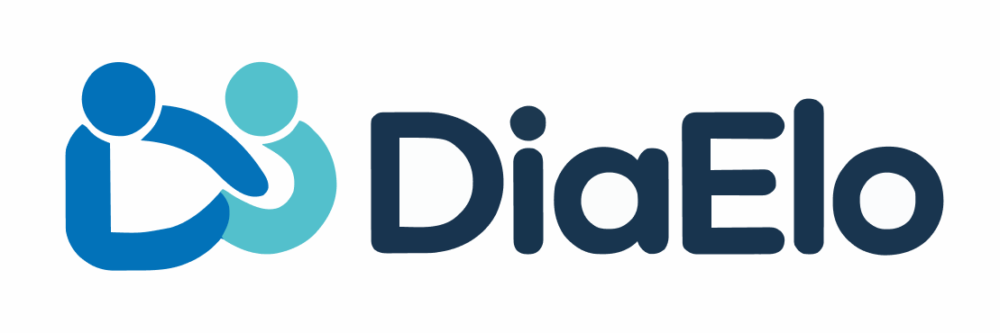
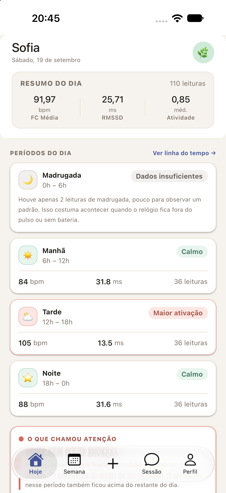

#

Uma solução mobile voltada para responsáveis por
crianças atípicas. O objetivo é transformar sinais da rotina coletados
por dispositivos vestíveis em informações simples e contextualizadas
para a família e para a próxima sessão terapêutica.

> 🌟 O contexto da semana chega antes da sessão.

## 📃 Contexto

Durante a rotina da criança, o DiaElo recebe sinais disponíveis por meio
de dispositivos vestíveis, como frequência cardíaca, RMSSD,
atividade/movimento e indicadores agregados de ativação.

A aplicação organiza esses dados por períodos do dia e apresenta
observações geradas pela API.

O responsável também poderá registrar acontecimentos importantes da
rotina. Em uma evolução futura, esses registros poderão ser relacionados
aos sinais coletados para construir um contexto semanal mais completo e
preparar o terapeuta para a sessão.

O produto não tem como objetivo diagnosticar emoções, crises ou
condições médicas. Os dados representam sinais fisiológicos e devem ser
utilizados como ponto de partida para observação e conversa com os
profissionais que acompanham a criança.

## ⚒️ Tecnologias

    


## Requisitos

   

#### Para iOS nativo

 

#### Para Android nativo

 

## 🎨 Design

Desenvolvido no [Figma Make](https://www.figma.com/make/BCzCk4IHDBePPq6rMiblNt/DiaElo-Mobile-App?code-node-id=0-6&p=f&t=lt5I49pEbRHAuOP4-0&fullscreen=1)



## Instalação

```bash
git clone https://github.com/AlvaroPereir4/Tech4Change-DiaElo-Grupo-09.git
cd Tech4Change-DiaElo-Grupo-09/mobile
yarn install
```

## 📱 Expo Go

Inicie o servidor:

```bash
npx expo start
```

Abra o projeto pelo QR Code usando o Expo Go.

Também é possível iniciar diretamente:

```bash
npx expo start --android
```

```bash
npx expo start --ios
```

## 📲 Development Build

O projeto possui `expo-dev-client`.

#### 🍏 Para criar e executar a versão nativa no iOS:

```bash
npx expo run:ios
```

#### 🤖 Para Android:

```bash
npx expo run:android
```

## 🔌 API

A API do DiaElo está hospedada em:

http://168.75.104.67:8000

A documentação Swagger/OpenAPI está disponível em:

http://168.75.104.67:8000/docs

A URL base deve ficar centralizada na configuração do projeto.

## Contrato de dados

Um exemplo de retorno dos dados pode ser encontrado em [/mocks](src/mock/index.json)

Quando `conclusive` for `false`, o frontend deve respeitar a ausência de
dados e não inventar valores.

## 🛡️ Princípios do frontend

Todos os valores exibidos devem ser derivados da API. O frontend não
deve criar números, datas, leituras, estados, observações ou insights
fictícios.

A interface deve diferenciar dados observados de interpretações e nunca
apresentar sinais fisiológicos como diagnóstico ou emoção detectada.

Preferir termos como:

- maior ativação
- dentro do padrão
- dados insuficientes
- observação
- ponto para conversar

## Fluxo do MVP

```text
Resumo do dia
      |
      v
Períodos do dia
      |
      v
Detalhes e observações
      |
      v
Contexto da semana
      |
      v
Sessão terapêutica
```

O registro de acontecimentos da família representa a próxima camada do
produto e permitirá relacionar contexto familiar e sinais da rotina.

## Status

Projeto em desenvolvimento e fase de MVP.

## Licença

[🪪 LICENSE](./LICENSE)
